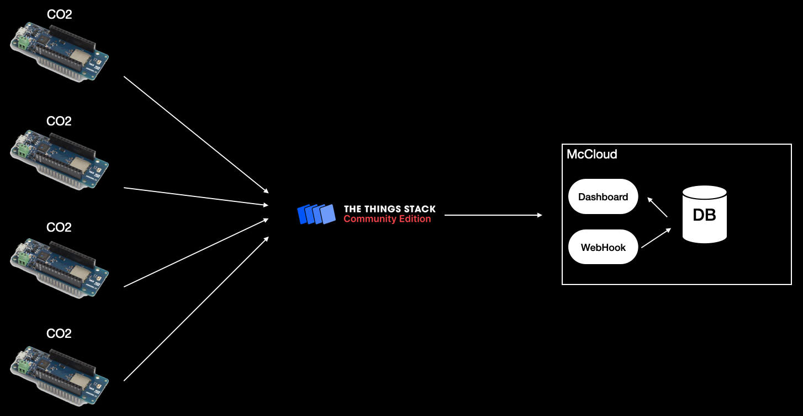
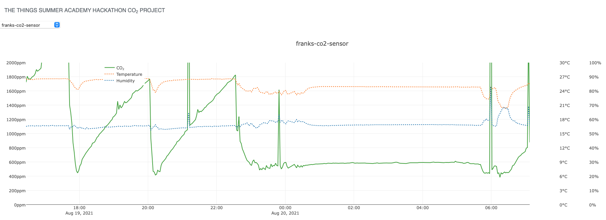

# TTSA_Hack_CO2
The Things Summer Academy 2021 Hackathon CO2 Measurement Project

We made a solution to bring measurements in from different CO2 sensors around the globe and show it on a graph.

## Solution diagram

## Screenshot of dashboard
[Dashboard](https://eu1.ttsa.descartes.net/TT4102138/SensorDashBoard.php)

## Hardware used
- Arduino MKR WAM 1300
- Arduino MKR ENV
- Heltech ESP32 LoRa V2
- Sensirion SCD30

# Provided Code
The following list explains etch file.

- **[TTS.WebHook.Tab.php](./TTS.WebHook.Tab.php)**:
Webhook importer receive the data from The Things Stack and saves it to a database

- **[SensorDashBoard.php](./SensorDashBoard.php)**:
Frontend to our solution, showing a graph from selected sensor

- **[getData.php](./getData.php)**:
Will retrieve historical data and pass it to the chart

